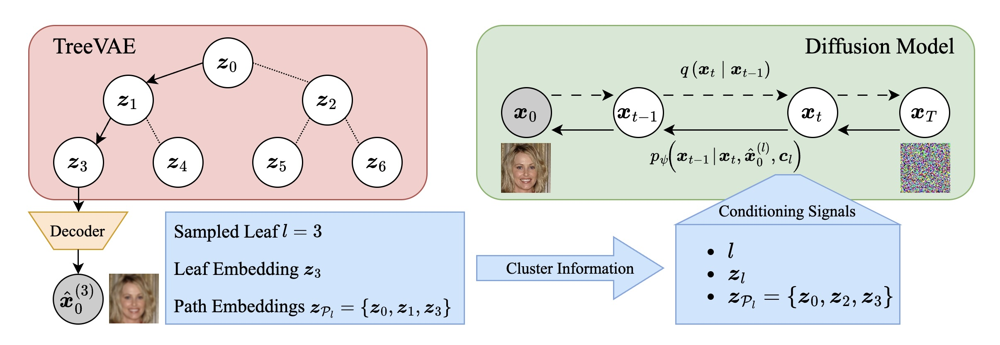
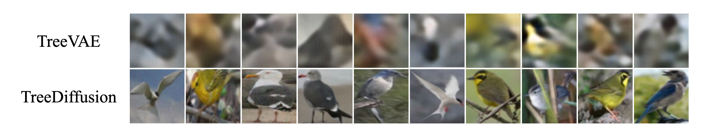
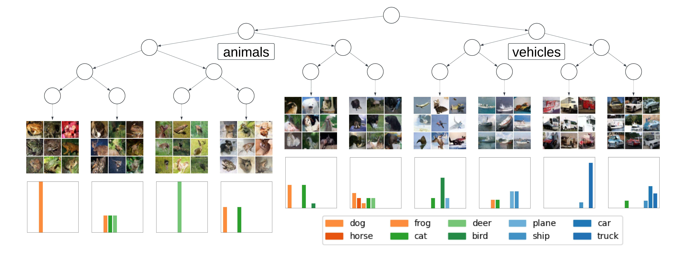
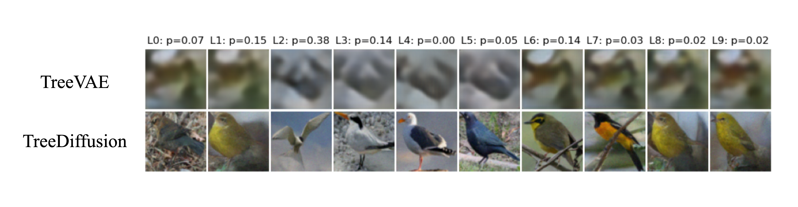

# Hierarchical Clustering for Conditional Diffusion in Image Generation


This repository contains the implementation of **TreeDiffusion**.

---


### TreeDiffusion

TreeDiffusion is a deep generative model that incorporates hierarchical clustering into the framework of Diffusion Models ([Sohl-Dickstein et al., 2015](https://proceedings.mlr.press/v37/sohl-dickstein15.html); [Ho et al., 2020](https://proceedings.neurips.cc/paper/2020/file/4c5bcfec8584af0d967f1ab10179ca4b-Paper.pdf); [Song et al., 2021](https://iclr.cc/virtual/2021/poster/2804)). It enables cluster-guided diffusion in unsupervised settings, as opposed to classifier-guided diffusion for labeled data, as introduced by [Dhariwal et al. (2021)](https://arxiv.org/abs/2105.05233). In our framework, the [TreeVAE](https://github.com/lauramanduchi/treevae) by [Manduchi et. al. (2023)](https://neurips.cc/virtual/2023/poster/71188) serves as the clustering model, encoding hierarchical clusters within its latent tree structure, where the leaves represent the clusters. A second-stage diffusion model conditioned on the TreeVAE leaves, utilizes these leaf representations to generate improved cluster-conditional samples. This is achieved using an adapted version of the [DiffuseVAE framework](https://github.com/JoGo175/DiffuseVAE/tree/main) by [Pandey et. al. (2022)](https://arxiv.org/abs/2201.00308). The result is a model that not only improves image quality but also ensures that the generated samples are representative of their respective clusters, addressing the limitations of previous VAE-based methods and advancing the state of clustering-based generative modeling. 

The following figure illustrates the architecture and workflow of TreeDiffusion.




## Setting up the Dependencies

```
conda env create --name envname --file=treevae.yml
conda activate envname
```

## Supported Datasets

Currently, the code supports the following datasets: 

- MNIST (`"mnist"`)
- FashionMNIST (`"fmnist"`)
- CIFAR-10 (`"cifar10"`)
- CelebA (`"celeba"`)
- CUBICC (`"cubicc"`)


## TreeVAE Training 

To train and evaluate the TreeVAE model, you can use the `main.py` script. Follow the steps below to configure and run your training session.


### Model Training

The recommended approach is to modify the appropriate `.yml` file in the `configs` folder to set up your configurations. Once you've updated the configuration file, run the following command for the desired dataset:
```
python main.py --config_name "cifar10"
```


### Image Generation

Given a trained and saved TreeVAE model on a given dataset, you can use the following command to generate the 10,000 reconstructions of the testset (mode = `"vae_recons"`) or create 10,000 newly generated images (mode = `"vae_samples"`) for each leaf in the tree. In the following command, `"/20240307-195731_9e95e"` denotes the folder in the `"models/experiments/{dataset}"` directory for the trained TreeVAE instance. However, the specific folder name will be different for each trained model instance.
```
python vae_generations.py --config_name "cifar10" --seed 1 --mode "vae_recons" --model_name "/20240307-195731_9e95e"
```


## DDPM Training

Given a trained and saved TreeVAE model, you can train the conditional second-stage DDPM for the TreeDiffusion model using the `train_ddpm.py` script. 

### Model Training

The recommended approach is to modify the appropriate `.yml` file in the `configs` folder to set up your configurations. In particular, make sure to update the paths, such as the directory to the folder of the pre-trained TreeVAE model on which the DDPM is conditioned (`vae_chkpt_path`), the results directory (`results_dir`). Once you've updated the configuration file, run the following command for the desired dataset:
```
python train_ddpm.py --config_name "cifar10"
```

### Image Generation

To retrieve the reconstructions or samples from the diffusion model, further adjust the appropriate `.yml` file in the `configs` script with the corresponding paths to the trained DDPM model (`chkpt_path`). You can use the following command to generate the 10,000 reconstructions of the testset for the most probable leaf (eval_mode = `"recons"`) or for all leaves (eval_mode = `"recons_all_leaves"`). Furhtermore, you can create 10,000 newly generated images for the most probable leaf (eval_mode = `"sample"`) or for all leaves (eval_mode = `"sample_all_leaves"`). 
```
python test_ddpm.py --config_name $dataset --seed $seed --eval_mode "sample"
```


## Results

Below, we present some key results achieved using the models.


### Image Quality

We compare the reconstruction quality of test set images between the TreeVAE and TreeDiffusion models. The TreeDiffusion model generates images of higher quality and with a distribution closer to the original data distribution.



### Leaf-specific Generations

The TreeVAE model can generate leaf-specific images, where each leaf represents a cluster. The image below showcases randomly generated images from a TreeDiffusion model trained on CIFAR-10.

To evaluate the quality of the generated images, we trained a classifier on the original dataset and used it to classify the newly generated images from our TreeDiffusion, analyzing each cluster separately. Ideally, most images from a cluster should be classified into one or very few classes from the original dataset, indicating "pure" or "unambiguous" generations. The normalized histograms below the leaf-specific generated images show the distribution of predicted classes for these new images.





For the classifier, we utilize a ResNet-50 model [(He et al., 2016)](https://www.cv-foundation.org/openaccess/content_cvpr_2016/papers/He_Deep_Residual_Learning_CVPR_2016_paper.pdf) trained on each dataset. The pre-trained classifiers are included in this repo under the `"classifier_pretraining"` directory. If you want to retrain the models yourself, you can run the following command: 
```
python classifier_pretraining/clf_training.py --data_name "cifar10"
```


### Cluster-conditioning in TreeDiffusion


The following image compares the TreeVAE with TreeDiffusion. The picture shows the image generations from each leaf of the TreeVAE and the cluster-conditional TreeDiffusion, all trained on CUBICC. Each row displays the generated images from all leaves of the specified model, starting with the same sample from the root. The corresponding leaf probabilities are shown at the top of the image and are by design the same for all models by design. The results show that the cluster-conditional TreeDiffusion model produces higher quality and more diverse images, better adapting to each cluster.




# References

[Dhariwal, P., and Nichol, A. Diffusion models beat gans on image synthesis. In *Advances in neural information processing systems*, volume 34, pp. 8780-8794. Curran Associates, Inc., 2021.](https://arxiv.org/abs/2105.05233)

[He, K., Zhang, X., Ren, S., and Sun, J. Deep Residual Learning for Image Recognition. In *2016 IEEE Conference on Computer Vision and Pattern Recognition (CVPR)*, pp. 770–778, 2016.](https://www.cv-foundation.org/openaccess/content_cvpr_2016/papers/He_Deep_Residual_Learning_CVPR_2016_paper.pdf)

[Ho, J., Jain, A., and Abbeel, P. Denoising Diffusion Probabilistic Models. In *Advances in Neural Information Processing Systems*, volume 33, pp. 6840–6851. Curran Associates, Inc., 2020.](https://proceedings.neurips.cc/paper/2020/file/4c5bcfec8584af0d967f1ab10179ca4b-Paper.pdf)

[Manduchi, L., Vandenhirtz, M., Ryser, A., and Vogt, J. Tree Variational Autoencoders. In *Advances in Neural Information Processing Systems*, volume 36, 2023.](https://neurips.cc/virtual/2023/poster/71188)

[Pandey, K., Mukherjee, A., Rai, P., and Kumar, A. DiffuseVAE: Efficient, Controllable and High-Fidelity Generation from Low-Dimensional Latents. *Transactions on Machine Learning Research*, 2022.](https://arxiv.org/abs/2201.00308)

[Sohl-Dickstein, J., Weiss, E., Maheswaranathan, N., and Ganguli, S. Deep unsupervised learning using nonequilibrium thermodynamics. In *International conference on machine learning*, pp. 2256–2265. PMLR, 2015.](https://proceedings.mlr.press/v37/sohl-dickstein15.html)

[Song, J., Meng, C., and Ermon, S. Denoising Diffusion Implicit Models. In *International Conference on Learning Representations*, 2020.](https://iclr.cc/virtual/2021/poster/2804)
