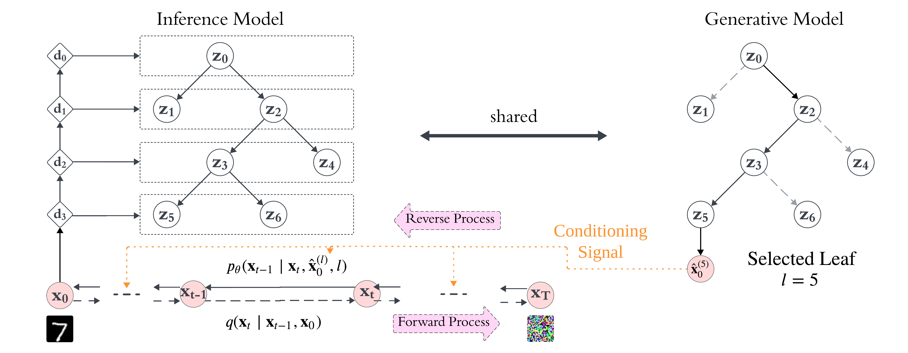
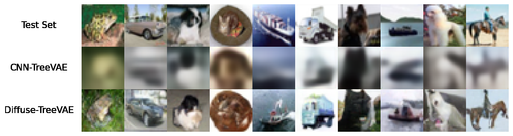

# Structured Generations: Using Hierarchical Clusters to guide Diffusion Models


This repository contains the implementation of **CNN-TreeVAE** and **Diffuse-TreeVAE**. 

---


### CNN-TreeVAE


**CNN-TreeVAE** is an enhanced version of the [TreeVAE implementation](https://github.com/lauramanduchi/treevae) by [Manduchi et. al. (2023)](https://neurips.cc/virtual/2023/poster/71188), designed to improve the generative capabilities and the hierarchical clustering performance of the original model. This is achieved by integrating convolutional neural networks (CNNs) and residual connections. TreeVAE constructs a binary tree where each node represents a latent variable influenced by its parent nodes, and samples probabilistically traverse to leaf nodes representing data clusters. Our CNN-TreeVAE adaptation maintains spatial information and utilizes lower-dimensional representations, resulting in more efficient learning and more flexible data representation. Despite the typical VAE issue of producing blurry images, the model's reconstructed images and learned clustering remain meaningful, serving as a robust foundation for our Diffuse-TreeVAE framework.

### Diffuse-TreeVAE

**Diffuse-TreeVAE** is a deep generative model that integrates hierarchical clustering into the framework of Denoising Diffusion Probabilistic Models (DDPMs).
The proposed approach generates new images by sampling from CNN-TreeVAE, and utilizes a second-stage DDPM to refine and generate distinct, high-quality images for each data cluster. This is achieved using an adapted version of the DiffuseVAE framework by [Pandey et. al. (2022)](https://arxiv.org/abs/2201.00308). The result is a model that not only improves image clarity but also ensures that the generated samples are representative of their respective clusters, addressing the limitations of previous VAE-based methods and advancing the state of clustering-based generative modeling. The following figure illustrates the architecture and workflow of Diffuse-TreeVAE.




## Setting up the dependencies

```
conda env create --name envname --file=treevae.yml
conda activate envname
```

## Supported Datasets

Currently, the code supports the following datasets: 

- MNIST (`"mnist"`)
- FashionMNIST (`"fmnist"`)
- CIFAR-10 (`"cifar10"`)


## CNN-TreeVAE Training 

To train and evaluate the CNN-TreeVAE model, you can use the `main.py` script. Follow the steps below to configure and run your training session.


### Model Training

The recommended approach is to modify the appropriate `.yml` file in the `configs` folder to set up your configurations. Once you've updated the configuration file, run the following command for the desired dataset:
```
python main.py --config_name "cifar10"
```


### Image Generation

Given a trained and saved CNN-TreeVAE model on a given dataset, you can use the following command to generate the 10,000 reconstructions of the testset (mode = `vae_recons`) or create 10,000 newly generated images (mode = `vae_samples`). In the following command, `"/20240307-195731_9e95e"` denotes the folder in the `"models/experiments/{dataset}"` directory for the trained CNN-TreeVAE instance. 
```
python vae_generations.py --config_name "cifar10" --mode "vae_recon" --model_name "/20240307-195731_9e95e" 
```


## Diffuse-TreeVAE Training

Given a trained and saved CNN-TreeVAE model, you can train the conditional second-stage DDPM for the Diffuse-TreeVAE model using the `train_ddpm.py` script. 

### Model Training

The recommended approach is to modify the appropriate `.yml` file in the `configs` folder to set up your configurations. In particular, make sure to update the paths, such as the directory to the folder of the pre-trained CNN-TreeVAE model on which the DDPM is conditioned. Once you've updated the configuration file, run the following command for the desired dataset:
```
python train_ddpm.py --config_name "cifar10"
```

### Image Generation


To retrieve the reconstructions or samples from the diffusion model, further adjust the appropriate `.yml` file in the `configs` script with the corresponding paths to the trained DDPM model. You can use the following command to generate the 10,000 reconstructions of the testset for the most probable leaf (eval_mode = `recons`) or for all leaves (eval_mode = `recons_all_leaves`). Furhtermore, you can create 10,000 newly generated images for the most probable leaf (eval_mode = `sample`) or for all leaves (eval_mode = `sample_all_leaves`). 
```
python test_ddpm.py --config_name $dataset --seed $seed --eval_mode "sample""
```


## Results

Here, we list a couple of results that were attained.

### Reconstruction Quality


compare the reconstruction quality of test set images for the CNN-TreeVAE and the Diffuse-TreeVAE
The latter model is able to generate images of higher quality and whose distribution is closer to the original data distribution



### Cluster


### Cluster-conditioning 

comparison of generated images for a Diffuse-TreeVAE models that have been condition on the selected cluster index vs without conditioning on the selected cluster index, otherwise the models are the same 


# References

[Ho, J., Jain, A., and Abbeel, P. Denoising Diffusion Probabilistic Models. In *Advances in Neural Information Processing Systems*, volume 33, pp. 6840–6851. Curran Associates, Inc., 2020.](https://proceedings.neurips.cc/paper/2020/file/4c5bcfec8584af0d967f1ab10179ca4b-Paper.pdf)

[Manduchi, L., Vandenhirtz, M., Ryser, A., and Vogt, J. Tree Variational Autoencoders. In *Advances in Neural Information Processing Systems*, volume 36, December 2023.](https://neurips.cc/virtual/2023/poster/71188)

[Pandey, K., Mukherjee, A., Rai, P., and Kumar, A. DiffuseVAE: Efficient, Controllable and High-Fidelity Generation from Low-Dimensional Latents. *Transactions on Machine Learning Research*, August 2022. ISSN 2835-8856](https://arxiv.org/abs/2201.00308)
